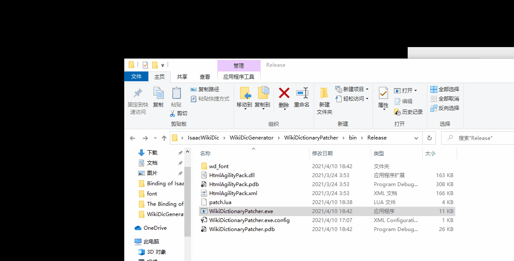

# 许可协议

 本作品采用<a rel="license" href="http://creativecommons.org/licenses/by-nc-sa/3.0/">知识共享署名-非商业性使用-相同方式共享 3.0 未本地化版本许可协议</a>进行许可。

# 下载地址

此页是源代码，不是软件。

下载软件：[点我下载](https://gitee.com/frto027/isaac-wiki-dictionary/releases)或[点我去github下载（备用）](https://github.com/frto027/IsaacWikiDictionary/releases)

# 依赖说明

如果您的电脑系统过旧（特定版本的Windows7及以下系统），需要安装.Net Framework 4.5.2才能正常使用。

[点我下载.Net Framework 4.5.2](https://www.microsoft.com/zh-CN/download/details.aspx?id=42642)

# 图鉴介绍

这是一个可以自动下载道具介绍的以撒内置图鉴。

把鼠标移动到地面上的道具，就可以看到效果。

图鉴信息来源于[灰机wiki](https://isaac.huijiwiki.com/wiki/%E9%81%93%E5%85%B7)。

英文图鉴信息来源于Fandom wiki:[Binding of Isaac: Rebirth Wiki is a Fandom Gaming Community](https://bindingofisaacrebirth.fandom.com/wiki/Binding_of_Isaac:_Rebirth_Wiki)

# 缓存如何工作？

由于考虑到开源缓存同步机器人可能对wiki服务器造成不良影响，缓存同步机器人没有开源。机器人请求的`MediaWiki API`接口为`expandtemplates`，使用此接口对道具模板进行展开，请求结果直接保存为json文件作为缓存。您可以在代码中预置的URL里看到缓存内容。

如果想要使用wiki的api自行编写机器人，请务必遵守相应的礼仪规范。

# 在游戏中是怎么工作的

> 图鉴功能越来越多，如果一开始不设计好，很容易就会写烂尾。这是一份超简易的工作方式的说明。
### 安装
安装器使用`C#`编写，原因是功能够用的情况下可以避开一系列的奇怪问题，确保不会有人问出`为啥python下载不了` `为啥node安装不上` `为什么ClassNotFoundException` `java下载的时候要怎么注册` `找不到动态链接库该怎么办`这样的问题。

安装器运行后，会将wd_res文件夹中的文件根据功能需要，拷贝到游戏的resource文件夹。也会将patch.lua文件追加到游戏的`resources\scripts\main.lua`末尾，但会进行一些修改。  
- lua的首尾添加`-- WikiDic MARK START --` `-- WikiDict MARK END --`用来标记改动位置。main.lua中是否存在这两个标记，会作为图鉴是否安装的标准。
- lua的末尾追加类似`-- WIKIDIC_VERSION_1 --`这样的字符串，通过识别这个字符串来了解玩家安装的是哪个版本的图鉴，有些版本之间不兼容，卸载会出问题，这样就能识别这种情况并给出提示。这个标记只在新版本有，所以没有这个标记就说明是旧版本。
- lua中的`-- FAKE_DESC_CONTENT --` `-- FAKE_TRINKET_CONTENT` `-- FAKE_CARD_CONTENT --` `-- FAKE_PILL_CONTENT`被替换成从wiki中下载解析得到的数据。
- lua中的`-- FAKE_CONFIG_SEG_1 --`被替换成安装配置数据

### 卸载

最新的版本在卸载时，先检查`-- WIKIDIC_VERSION_1 --`这样的版本标记，如果符合，就将main.lua中的`-- WikiDic MARK START --` `-- WikiDict MARK END --`两个标记中间的代码删掉，然后将`wd_res`文件夹整个删掉。不符合的话会提示使用对应版本卸载。

### 游戏加载

不论游戏是否启动了mod系统，它都会加载main.lua。游戏加载main.lua的时机发生在mod系统加载的时刻，但加载main.lua的时候mod系统并没有完全初始化，因此很多初始化代码不能放到lua文件中直接进行，所以就有了`WikiDic:InitFonts`函数。  

当在lua中请求wd_res目录下的资源时，游戏会按照原有的逻辑，先去查找packed下已压缩的资源，但找不到这些资源，所以就会去查找未压缩的文件夹`wd_res`。这样就做到了给游戏追加中文字体、二维码图片等资源。

# Debug版本编译无法下载元数据？

把源码第二行注释掉即可，这是用来切换本地缓存的一个开关。是用来调试的。

# 版权声明

此程序作品涉及到`安装程序`即其自动化生成的`游戏内图鉴（即游戏补丁）`两部分，因性质不同而分别使用不同的许可协议。

其中：

- 安装程序是开源自由软件，其源码**并非基于wiki内容开发**，仅包含直接或间接指向wiki的链接，具有对wiki内容加工处理的功能，但**本身不含任何受CC保护的内容**，故使用MIT许可协议进行分发。
- 安装程序在运行时对**通过缓存或直接访问得到的来自wiki的内容**进行自动化转换处理，处理后的信息以补丁的形式写入游戏。按照协议要求，此补丁遵循`CC BY-NC-SA 3.0`进行分发。

此软件具有对wiki进行二次创作的能力，本身受到MIT许可保护，如果您对此软件进行修改后，依旧使用了wiki作为数据源，其生成的补丁内容自然受到`CC BY-NC-SA 3.0`协议保护，需遵循相关协议。
